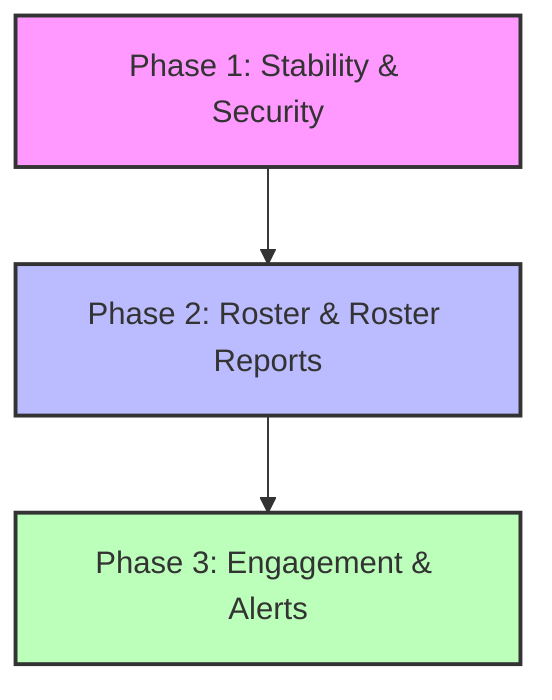

# Business & Product Evaluation: Student Attention Monitor

This document provides a holistic analysis of the Student Attention Monitor codebase and product design. It evaluates the project from a business, product-experience, and architectural perspective to identify missing modules, core design limitations, and technical risks before deploying to live classrooms.

---

## 1. Product Concept & Business Value

The Student Attention Monitor addresses a major pain point in digital and hybrid classrooms: **teacher cognitive fatigue and lack of engagement insights**. 

### The Core Value Loop
1. **Frictionless Onboarding**: Instead of installing heavy monitoring software, students join a session using a temporary browser-based link.
2. **Privacy-First Processing**: Processing webcam feeds locally via MediaPipe WASM ensures that no video feed leaves the device. Only numeric telemetry (yaw, pitch, flags, attention score) goes to the server.
3. **Actionable Intervention**: Teachers receive real-time updates and notifications on a visual dashboard when student attention drops, allowing immediate course correction during a lecture.

---

## 2. Missing Modules & Features (Unachieved MVP Deliverables)

While the core socket-based live telemetry pipeline is fully implemented and tested, several features defined as in-scope for the MVP are completely missing from the codebase:

| Feature/Module | Current Status in Code | Business Impact |
| :--- | :--- | :--- |
| **PDF Report Export** | ❌ **Missing**: The route `/api/sessions/{id}/export/pdf` is documented in `CLAUDE.md` and `README.md` but is not implemented. There is no PDF generation library or service in the backend. | **High**: Teachers and administrators cannot easily download, print, or archive session records for compliance or parent-teacher reviews. |
| **Daily Report / Email Dispatch** | ❌ **Missing**: The system has no email service (SMTP/SES), no scheduler/cron manager, and no database aggregator to bundle daily sessions. | **High**: Teachers have to manually log in to the dashboard and view each session individually. There is no push-mechanism to deliver summaries. |
| **Tampering & Cam-Off Alerts** | ⚠️ **Partial**: While the client sends a `no_face` flag when the webcam is covered or the user steps away, there is no active alert on the backend for tab-switching, minimized windows, or device disconnects. | **Medium**: Students can bypass monitoring by minimizing the tab or locking their screens, which limits the reliability of the telemetry. |

---

## 3. Product & Business Experience Flaws

Evaluating the system through a commercial product lens reveals several critical operational and user experience gaps:

### A. The "Roster vs. Link" Dilemma (No Persistent Student Identity)
* **The Problem**: There are no persistent student accounts. Every time a student joins a session, they type their name and roll number. The backend creates a brand-new `Student` row with a unique ID and token.
* **The Business Impact**: 
  - **Typo Vulnerability**: If a student enters their roll number with a typo (e.g., `CS-101` vs. `CS101`), they are treated as a brand-new student, segmenting their historical data.
  - **No Long-Term Analytics**: A teacher cannot view a student's attention trend over a 15-week semester because there is no persistent link tying session-specific student records together.
  - **Fake Names**: Students can enter spoofed or offensive names when joining, disrupting the teacher's dashboard.

### B. Dashboard Alert Fatigue (Cognitive Overload)
* **The Problem**: The teacher dashboard displays all students in a uniform, grid-based layout. 
* **The Business Impact**: If a class has 60 students, looking at 60 active tiles (some flashing, some changing numbers every 3 seconds) is overwhelming. A teacher who is lecturing cannot parse this noise. The system should prioritize **by exception**—bringing distracted or at-risk students to the top of the feed and grouping attentive students into a quiet summary stat.

### C. The Friction of Webcam Permissions
* **The Problem**: Local browser face-mesh requires webcam access. 
* **The Business Impact**: School-managed devices often have strict browser policies blocking cameras. Additionally, camera use can trigger student anxiety. The product lacks a clear, welcoming consent screen that explains the local privacy mechanism before triggering the browser's scary webcam permissions prompt.

---

## 4. Critical Technical & Security Bottlenecks

An inspection of the codebase reveals several technical risks that could cause memory exhaustion or API downtime under real classroom loads:

> [!CAUTION]
> ### 1. Redis Memory Leak (No TTL on Telemetry Buffers)
> In `backend/services/redis_service.py`, rolling score buffers are updated using `rpush` and capped at 20 items. However, **no expiration time (TTL) is ever set on these list keys** (`signals:{session_id}:{student_id}`).
> - **Risk**: After a session ends, these keys remain in Redis memory indefinitely. Over weeks of daily classes, the Redis cache will leak memory and eventually crash the server.

> [!WARNING]
> ### 2. Event-Loop Blocking in CSV Export
> The CSV export helper `_build_csv` loads all attention signals for a session from the database in a single query, processes them, and returns them as a single string.
> - **Risk**: For a 1-hour session with 50 students sending signals every 3 seconds, that represents **60,000 signals**. Converting 60,000 SQLAlchemy models into a large string in-memory blocks the single-threaded Python event loop, causing live WebSocket connections to drop and api requests to timeout.

> [!WARNING]
> ### 3. Public Student Registration & Spoofing
> The student join route `/api/sessions/{session_id}/join` is completely public and unauthenticated.
> - **Risk**: Anyone with a session ID can self-register. Because socket communication relies on a simple, un-hashed token, a student with basic tech skills could write a script to register dozens of virtual students and spam fake telemetry to flood the teacher's dashboard.

---

## 5. Strategic Roadmap & Recommendations

To prepare this system for pilot testing and eventual commercialization, the following work phases are proposed:

### Phase 1: Stability, Security, and Core Compliance (Immediate Fixes)
1. **Fix Redis Leaks**: Add a 2-hour TTL to both the student state keys and the rolling signal buffer keys in Redis when a signal is processed.
2. **Async Streaming Exports**: Rewrite the CSV export route to use database streaming and a generator to return CSV data chunk by chunk instead of loading it all into memory.
3. **Build the PDF Export Service**: Install `reportlab` or a similar lightweight engine in the backend and implement the `/api/sessions/{id}/export/pdf` route to generate beautiful, structured session summaries.

### Phase 2: Roster Management & Persistent Analytics
1. **Class Roster System**: Allow teachers to pre-register their student roster (name + roll number).
2. **Secure Joining**: When a student joins, they must select their name from the roster (or enter their pre-assigned ID). The system will issue a secure cookie or token, blocking arbitrary registrations.
3. **Multi-Session Reports**: Create a "Student Directory" page where teachers can see a student's average attendance, average attention score, and alert frequency across all historical sessions.

### Phase 3: Teacher-First Dashboard Enhancements
1. **Alert-First Sorting**: Automatically bubble students in the `alert` (red) or `at_risk` (orange) state to the top-left of the student grid, making them instantly visible.
2. **Consent & Privacy Onboarding**: Add a simple onboarding screen to `/join/[id]` detailing exactly what data is collected (numeric only, no video leaves device) to build user trust before camera activation.
3. **Automated Daily Summaries**: Integrate a simple task scheduler (e.g. `APScheduler` or FastAPI background tasks) and email service to send a summary of the day's classrooms to the teacher's inbox at 5:00 PM.
